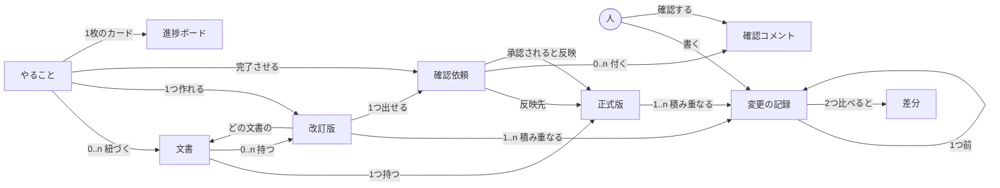

# 概念モデル (意味ネットワーク)

**目的:** UI を描く前に、この領域に何があり、どう繋がっているかを固定する。
画面はこのモデルから導く。モデルに無いものを画面に出さない。

**方法:** モデルベースUIデザイン。人の記憶は意味ネットワークとして繋がっているため、
その繋がりに近い形で画面を構成すると、覚え直さずに使える。

---

## 1. 意味ネットワーク



---

## 2. 対象の定義

| 業務での呼び方 | 内部の実体 (Git) | 何であるか |
|---|---|---|
| **文書** | ファイル (Docs/Sheets/Slides) | 管理する対象そのもの。就業規則など |
| **正式版** | main の内容 | いま効力を持つ版。全員が見る |
| **改訂版** | ブランチ (作業コピー) | 直している途中の版。文書ごとに何本でも持てる |
| **変更の記録** | コミット | ある時点の中身を丸ごと残したもの |
| **差分** | diff | 2つの記録の違い |
| **確認依頼** | プルリクエスト | 改訂版を正式版に反映してよいか尋ねるもの |
| **確認コメント / 承認** | レビュー | 依頼に対する意見と可否 |
| **やること** | Issue | 誰かがやるべき作業。文書に紐づく |
| **進捗ボード** | Projects | やることの進み具合 |

**「リポジトリ」は画面に出さない。** 文書が入っている場所であって、利用者が
操作する対象ではない。

---

## 3. 関係の重み

利用者が日常的に辿る道は次の2つに集約される。

```
① 読む:   文書 → 正式版の本文
② 直す:   やること → 文書 → 改訂版 → 変更の記録 → 確認依頼 → 正式版
```

②が業務そのものであり、この順序が**画面の並び順を決める**。

---

## 4. モデルから導かれる画面構造

### 根に置く対象

意味ネットワークで**他から辿られる側**が根になる。

- **文書** — ①②の両方の起点。最も多く辿られる。ホーム
- **やること** — ②の起点。文書に紐づくが、横断して見たい

改訂版・確認依頼・変更の記録は、いずれも**文書に従属する**。ただし
「自分が確認すべき依頼」は横断で見たいため、一覧への近道を左に置く。

### 画面の対応

| 画面 | 対応する対象 | 出るタイミング |
|---|---|---|
| 文書の一覧 | 文書 (集合) | ホーム |
| 文書の本文 | 正式版 / 改訂版 の内容 | 文書を開いたとき |
| 改訂の履歴 | 変更の記録 (集合) + 差分 | 文書を開いたとき |
| この文書の改訂版 | 改訂版 (集合) | 文書を開いたとき |
| 確認依頼の一覧 | 確認依頼 (集合) | 左から。横断 |
| やることの一覧 | やること (集合) | 左から。横断 |
| 進捗ボード | やること (状態別) | 左から。横断 |

**文書を選んでいないときにタブを出さない。** タブは開いている文書の
ビューであり、対象が無ければ意味を持たない。

### 左ナビに置くもの

```
文書            ← ホーム。対象の入口
改訂中の版 (n)  ← 横断。自分が直しかけているもの
確認依頼 (n)    ← 横断。自分が見るべきもの
やること (n)    ← 横断
進捗ボード
使い方
```

---

## 5. 動作と対象の分離

タブや見出しは**対象の名前**にする。動作はボタンにする。

| 対象 (画面の名前になる) | 動作 (ボタンになる) |
|---|---|
| 文書 / 正式版 / 改訂版 | 直す・記録する・依頼する |
| 変更の記録 / 差分 | 比べる |
| 確認依頼 | 意見を書く・承認する・反映する |
| やること | 作る・改訂版を作る・閉じる |

「編集」「コミット」「マージ」はいずれも動作であり、画面の名前に使わない。
